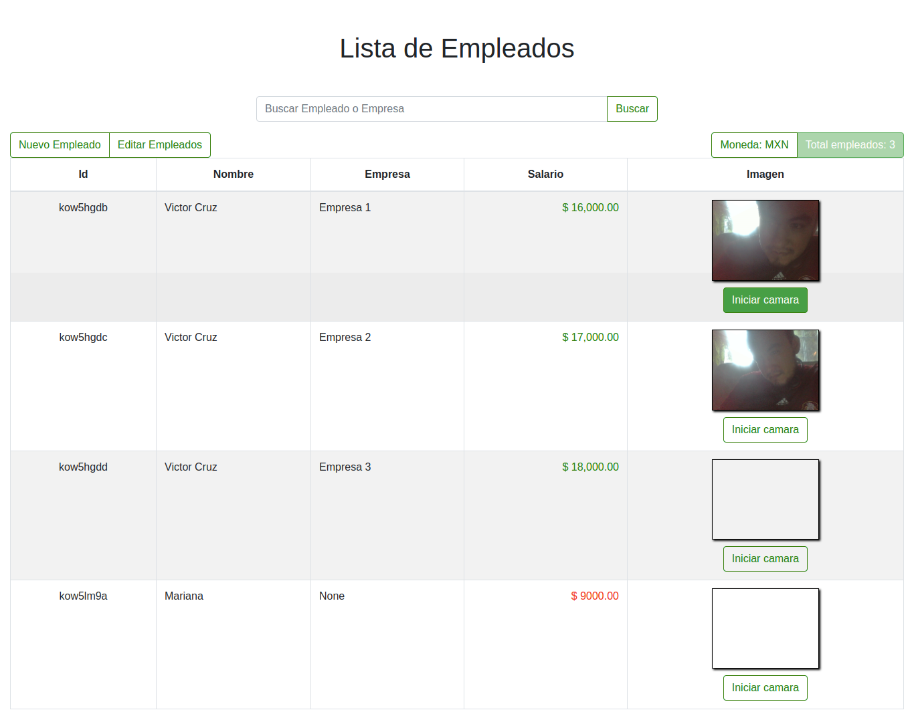

# Lista de empleados
Solución para una lista de empleados con las caracteristicas descritas.

## Tabla de contenido.
- [Lista de empleados](#lista-de-empleados)
  - [Tabla de contenido.](#tabla-de-contenido)
  - [Información General](#información-general)
    - [Actividades](#actividades)
    - [Instalación y prueba local](#instalación-y-prueba-local)
    - [Tecnologías usadas.](#tecnologías-usadas)
    - [Screenshot](#screenshot)
    - [Live preview](#live-preview)
  - [Estado del proyecto](#estado-del-proyecto)
    - [Bugs, errores y fixes](#bugs-errores-y-fixes)
  - [Referencias.](#referencias)

## Información General

Tabla con lista de empleados. Usando React, Bootstrap y JS.

Funcionalidades descritas en [Actividades](#actividades)

### Actividades

* [x] 1. Crear una tabla que muestre todas las propiedades de los empleados cumpliendo las siguientes características:
  * [x] El salario está en pesos mexicanos
  * [x] Mostrar el salario en formato de dinero, es decir 16900 se muestra
como $ 16,900.00.
  * [x] Si el salario tuviera decimales se deben mostrar limitados a 2 decimales,
es decir 16900.333 se debe mostrar como $ 16,900.33.
* [x] Adicionalmente en la tabla se debe de poder:
  * [x] Agregar empleados (Un botón al principio o final de la tabla).
  * [x] Editar empleados (Un botón al principio o final de la tabla).
  * [x] El nombre de la empresa no se debe poder modificar.
  * [x] Agregar un botón que muestre los salarios en USD, tipo de cambio de US
$1 = MXN $21.50.
* [x] Se debe conservar en un estado (desplegado en una cabecera):
  * [x] Total de empleados
  * [x] Si se están mostrando los salarios con MXN o USD
* [x] Poder filtrar empleados con un campo que permita buscar a los empleados por nombre y empresa:
  * [x] El mismo campo debe funcionar para nombre y empresa.
  * [x] Se deben actualizar los resultados conforme se vayan escribiendo.
* [ ] La tabla debe contener las siguientes características, algunas necesitarán agregar clases con CSS:
  * [x] Las filas deben de alternar el color del fondo
  * [x] Al hacer hover en una fila debe cambiar el color del fondo.
  * [x] Los montos deben ir alineados a la derecha
  * [x] Los caracteres de los montos deben estar monoespaciado
  * [x] Si el salario es menor a 10,000 mostrarlo en color rojo, si es mayor mostrarlo en color verde.
  * [x] Los botones de texto (como agregar nuevo empleado o imprimir a consola) deben tener fondo transparente y tener texto y borde en color verde.
  * [x] Al hacer hover deben de poner su color de fondo con el mismo color del borde y el texto pasa a ser color blanco, esto debe tener una transición.
* [x] Agregar una columna donde se muestre una captura de una imagen para cada uno de los empleados:
  * [x] Debe poderse elegirse un empleado y poder capturar un foto con la herramienta de RecordRTC.
  * [x] Debe permitir compatibildad con el navegador.
  * [x] La imagen debe guardarse de forma local y aparecer en el renglón del empleado elegido en la tabla.

### Instalación y prueba local
* Clonar repositorio con instrucción `git clone git@github.com:vicc30/lista-empleados.git`
* Cambiar a directorio `cd lista-empleados`
* Instalar paquetes de npm `yarn add`
* Para iniciar en local `yarn start`
* Abrir navegador en `localhost:3000`

### Tecnologías usadas.

* [Iconos - Font Awesome](https://fontawesome.com/)
* [Bootsrap](https://react-bootstrap.github.io/)
* [RecordRTC](https://github.com/muaz-khan/RecordRTC)
* React - Create-react-app
* Yarn
* CSS
* JavaScript
* [Generador de Id - uniqid](https://www.npmjs.com/package/uniqid)

### Screenshot

### Live preview

Link al prototipo en vivo en Heroku -> [Link](https://table-demo1.herokuapp.com/) 

## Estado del proyecto

Las actividades básicas se finalizaron sin embargo se realizarán actualizaciones de limpieza de código y mejorar funcionabilidad.

### Bugs, errores y fixes

Favor de reportarlo en el repo, sección issues-> [link](https://github.com/vicc30/lista-empleados/issues)

## Referencias.

* [Int Number Format](https://developer.mozilla.org/en-US/docs/Web/JavaScript/Reference/Global_Objects/Intl/NumberFormat)
* [ECMA Script](https://tc39.es/ecma402/#sec-intl-numberformat-constructor)
* [Updating a value in a nested array of objects](https://javascript.plainenglish.io/react-updating-a-value-in-state-array-7bae7c7eaef9)
* [RecordRTC](https://github.com/muaz-khan/RecordRTC)
* [DOM Media Stream Track](https://w3c.github.io/mediacapture-main/#dom-mediastreamtrack)
* [Web RTC API](https://developer.cdn.mozilla.net/en-US/docs/Web/API/WebRTC_API)